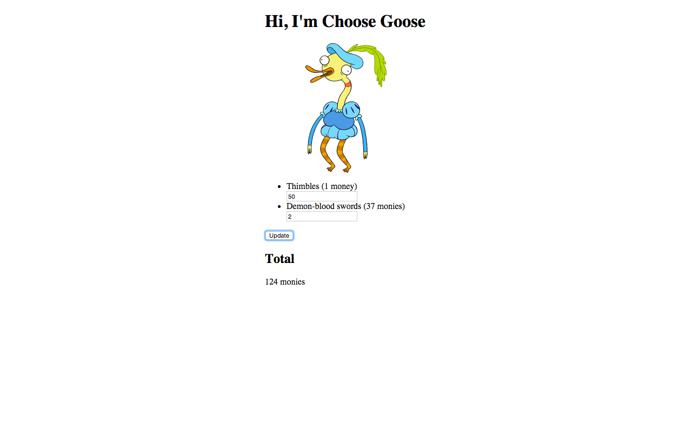

#3.2-Choose-Goose (JavaScript Practice)

This project was my first using JavaScript to create a functional form. It was also my first exposure to document.querySelector and .addEventEventListener's. All in all, its quite simple but great for practice.

